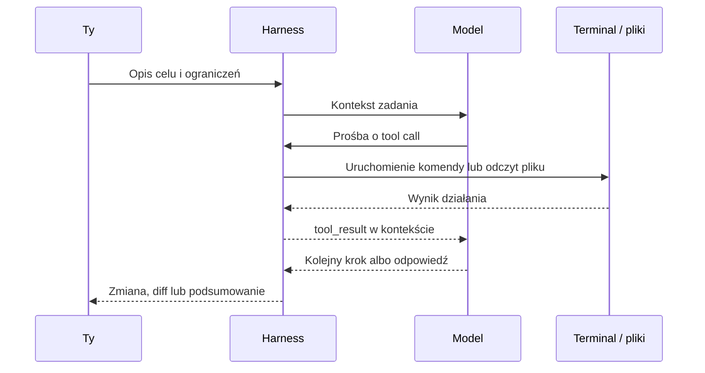
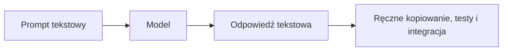
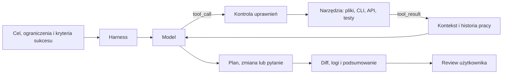

### Agent to coś więcej niż ChatGPT
Ekosystem AI w programowaniu to trzy warstwy: **model** (silnik tokenów), **agent** (system wykonujący zadanie przez narzędzia) i **harness** (dostęp, ograniczenia, pamięć robocza). Najczęstszy błąd: rozmowa z agentem jak z ChatGPT. Chatbot działa w statycznej pętli input → LLM → output — egzekucja, ewaluacja i integracja kodu wracają do ciebie; kontynuacja wątku często oznacza, że model opisuje kroki do ręcznego wdrożenia zamiast pracować za ciebie. Agent to system sterowany LLM z mechanizmem decyzyjnym i **tool use**: zgłasza zamiar użycia narzędzia, czeka na wynik, interpretuje go i iteruje. Pod spodem LLM nadal przewiduje następny token — różnica w tym, że token może oznaczać deklarację akcji („chcę uruchomić test”, „chcę przeczytać plik”, „chcę zmienić ten komponent”).
```json
{
  "role": "assistant",
  "content": [
    {
      "type": "text",
      "text": "Testy w auth.spec.ts nie przechodzą. Uruchamiam walidację, żeby przeanalizować stack trace."
    },
    {
      "type": "tool_use",
      "id": "toolu_01A09q90qw90lq917835lq9",
      "name": "execute_bash",
      "input": { "command": "npm run test:unit src/auth.spec.ts" }
    }
  ]
}
```
Aplikacja agentowa uruchamia polecenie w terminalu; po sukcesie lub błędzie harness wstrzykuje wynik do kontekstu modelu. Model aktualizuje plan i iteruje — operacja dzieje się poza LLM, na twoim komputerze, w repozytorium, z twoimi zależnościami.

Ten sam model (np. GPT lub Claude) daje różny efekt w zależności od miejsca uruchomienia: w prostym pluginie edytora wyjaśni błąd, ale niekoniecznie przeszuka repozytorium, utrzyma kontekst, uruchomi testy i pokaże czytelny diff. W mocnym coding harnessie tak — bo harness daje lepsze narzędzia, lepszy przepływ informacji i bardziej przewidywalną kontrolę.

### Co naprawdę wpływa na wynik
Łatwo przypisać sukces lub porażkę wyłącznie modelowi — to zbyt proste. Na wynik składają się cztery warstwy: **Model** — rozumuje, generuje tekst, wybiera krok i korzysta z narzędzi dostępnych w środowisku; **Harness** — udostępnia narzędzia, zarządza kontekstem, pyta o uprawnienia, ogranicza ryzykowne akcje i pokazuje wynik w czytelnej formie; **Środowisko lokalne** — repozytorium, zależności, testy, skrypty, zmienne środowiskowe, narzędzia takie jak `git`, `node`, `ffmpeg`, `gh`; **Polityka użytkownika** — czy agent tylko czyta pliki, czy też edytuje, uruchamia komendy, instaluje paczki albo pracuje bez zatwierdzania każdego kroku. Większość problemów nie wynika z „głupiego modelu”, lecz ze źle dobranej autonomii, braku testów, słabego kontekstu lub zbyt szerokich uprawnień.

### Harness jako warstwa kontroli
**Harness** to warstwa uruchomieniowa, integracyjna i konfiguracyjna — chroni przed zapętleniami, przypadkowymi zmianami i błędnym użyciem narzędzi; decyduje o jakości Cursor, Claude Code czy Codex. Typowy harness obejmuje: **narzędzia i schematy** (czytanie, wyszukiwanie, edycja, komendy, API, przeglądarka); **uprawnienia i sandboxing** (zgoda użytkownika, gdzie pisać, instalacja zależności, stop przed ryzykiem); **kontekst i pamięć roboczą** (co trafia do modelu, kompakcja, co znika z wątku, długa sesja); oraz harmonogram zadań, obsługę błędów narzędzi, telemetrię, diff do review, przyciski zatwierdzania i UI podglądu. Bez harnessu agent nie ma sprawczości, a ty — kontroli.



### Agent też może być chatbotem
Agent nie musi od razu edytować plików — eksploracja problemu, pytania, porządkowanie pojęć, szukanie brakujących założeń i pogłębianie wymagań to tania droga do jakości dalszej pracy (nie dlatego, że „chatbot wystarcza”, lecz że rozmowa podnosi jakość przed implementacją). Możesz prosić o wyjaśnienie błędu, porównanie rozwiązań, ryzyka w pomyśle lub serię pytań przed kodem. Dojrzały workflow zaczyna od tekstowej eksploracji, potem plan, edycja, testy i review diffu.

### Od rozmowy do realizacji celu
Agent w CLI ma dostęp do narzędzi OS — idziesz do przodu przez delegowanie zadań i kontrolę wyniku, nie przez przepisywanie instrukcji z odpowiedzi chatbota. Antywzorzec: mikrozarządzanie algorytmem — zamiast podawać każdą komendę, opisuj pożądany stan końcowy, ograniczenia i sposób weryfikacji. Komunikat jest deklaratywny (cel, granice, kryteria sukcesu); imperatywną robotę zostawiasz systemowi w kontrolowanym środowisku.
- **Masowe operacje na plikach:** „Przejrzyj wszystkie pliki `.svg` w folderze `/assets`, zoptymalizuj je przez SVGO, zmień nazwy na kebab-case i wygeneruj `index.ts` z eksportami”.
- **Praca z lokalnymi narzędziami:** „Skompresuj `video.mp4` poniżej 5 MB przez `ffmpeg`, ale zachowaj czytelny tekst na ekranie. Sprawdź wagę pliku po każdej próbie”.
- **Migracje i testy:** „Zaktualizuj zależności z prefiksem `aws-`, uruchom linter i testy, a przy problemach kompatybilności zaproponuj bezpieczną migrację”.

### Jak oceniać harness
Zanim powierzysz agentowi większe zadanie, oceń harness: czy czyta i wyszukuje pliki zamiast zgadywać strukturę, bezpiecznie edytuje kod (diff, stop przed ryzykiem) i uruchamia komendy z kontrolą uprawnień oraz sensowną reakcją na błędy; czy zarządza długim kontekstem (notatki, pamięć robocza) i pokazuje, co zrobił, co pominął i czego nie umiał. Jeśli na większość pytań odpowiadasz „nie wiem” — agent może pomóc, ale pod ścisłym nadzorem.

### Nowa epoka programowania z AI
Twoja rola to projektowanie środowiska pracy, dobór autonomii, granice bezpieczeństwa i zatwierdzanie decyzji wyższego poziomu — delegujesz fizyczną modyfikację plików i powtarzalne komendy, skupiasz się na intencji, ryzyku, jakości i sprawdzeniu, czy wynik dowozi wartość. Autonomia ma koszt: zapętlenie w narzędziach, bezsensowne testy, utrata decyzji po kompakcji kontekstu lub „naprawa” przez ukrywanie wyjątku zużywają tokeny. Kontrola wymaga planów, checkpointów, review diffu, testów, branchy i momentów „stop”.

### Na dobry początek
- **Decyzja:** trenuj współpracę z agentem i deleguj coraz złożniejsze zadania; unikaj sytuacji, w których AI steruje tobą — to wzorzec z przeszłości.
- **Kontrola:** zanim agent zmieni projekt — plan, zakres edycji i kryteria sukcesu; taniej poprawić plan niż sprzątać po złej autonomii.
- **Akcja:** przygotuj środowisko — reguły, działające zależności, testy, lintery, `git status` bez niespodzianek i krótki dokument zasad projektu dla agenta.
