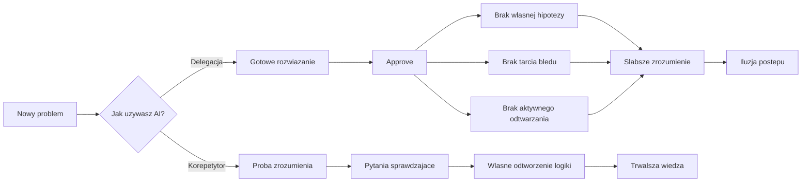

### Szybko nie znaczy głęboko
Najważniejszy failure mode: **approve bez obrony** — rozwiązanie istnieje, ale nie umiesz go obronić; w głowie nie powstał model problemu. Badanie Anthropic (`Trio`, 52 programistów): AI gorzej w zrozumieniu, czytaniu kodu i debugowaniu, bez istotnej oszczędności czasu — szybciej dowieziony task ≠ szybsze budowanie kompetencji; największa luka przy debugowaniu, bo AI omija tarcie błędu. Rozdziel **produktywność w zadaniu** i **rozwój kompetencji**. MIT _Your Brain on ChatGPT_ i Ethan Mollick: zbyt duża delegacja poznawcza i tryb „daj mi gotową odpowiedź” dają sygnał postępu, nie zawsze postęp.

### Dlaczego AI może psuć naukę
Gotowe rozwiązanie zbyt wcześnie omija etapy budowania zrozumienia: nie formułujesz własnej hipotezy; nie przechodzisz przez tarcie błędu (debugowanie składa model działania w głowie); nie wykonujesz aktywnego odtwarzania (czytanie daje poczucie znajomości, nie sprawdza użycia); za szybko masz poczucie domknięcia, choć wiedza jest powierzchowna. Tryb delegacji skraca drogę do wyniku, wycinając najcenniejsze fragmenty procesu nauki.



### Te same narzędzia, dwa różne wyniki
W badaniu Anthropic część osób uczyła się z AI bardzo dobrze — najmocniejszy wzorzec **Generation-then-Comprehension**: najpierw działające rozwiązanie, potem dopytywanie o logikę, konsekwencje, alternatywy i trade-offy. AI jako **generator** („zrób to za mnie”) i jako **korepetytor** („pomóż mi zrozumieć, co powstało i jak użyć następnym razem”) to dwa różne workflowy, nie dwa podobne style; domyślny ma być tryb korepetytora.

### 1. Zbuduj, potem rozłóż na części
Antywzorzec: zatrzymanie na „działa, więc idziemy dalej”. Proces: (1) zbuduj z AI, (2) tryb analizy, (3) pytaj „dlaczego akurat tak?” i „co by się zepsuło przy zmianie?”. Przywraca **elaborację** i **sprawdzanie zrozumienia** wycięte przez delegację. Failure mode: kiwasz głową, po dwóch dniach nic nie zostaje — bez pytania sprawdzającego lub własnego odtworzenia logiki tylko przeczytałeś.

```text
Uczę się nowego obszaru. Wyjaśniaj to, co właśnie powstało,
krok po kroku, jeden koncept naraz.

Po każdym kroku zadaj mi krótkie pytanie sprawdzające.
Nie przechodź dalej, dopóki nie odpowiem poprawnie.

Skupiaj się na "dlaczego tak", "jakie są trade-offy"
i "kiedy to podejście byłoby złym wyborem".

```

### 2. Domknij pamięć, nie tylko sesję
Dobra rozmowa z AI nie utrwala się sama — jeśli sesja była cenna, zamień ją od razu w materiał do aktywnego odtwarzania (np. fiszki do Anki). Pamięć wzmacnia się przez **próbę odzyskania informacji z głowy**, nie przez ponowne czytanie; meta-analiza Adesope: practice testing daje mocny wzrost retencji względem biernego przeglądania notatek.

```text
Na podstawie naszej rozmowy wygeneruj fiszki Q/A.
Skup się na kluczowych konceptach, decyzjach i sygnałach błędu,
nie na detalach składni.

Każda odpowiedź: maksymalnie 2-3 zdania.
Dodaj pytania, które sprawdzają zastosowanie wiedzy,
a nie tylko definicję.

```

### 3. Ustaw tryb nauki jako default
Dyscyplina zawodzi pod presją terminu — przerzuć część odpowiedzialności z nawyku na konfigurację narzędzia. Kryteria wyboru: czy prowadzi krokami zamiast wyrzucać gotowca, zadaje pytania sprawdzające, pomaga porównać alternatywy i trade-offy, da się przełączyć z dowiezienia taska na zrozumienie tematu — jeśli „nie”, dobry model częściej wyręczy niż uczy. Wbudowane tryby: Claude Code — output styles `Explanatory` i `Learning` przez `/config`; ChatGPT — `Study Mode`.

```text
Zachowuj się jak korepetytor programowania.

Wyjaśniaj krótko, ale konkretnie.
Pokazuj 2 perspektywy albo 2 sensowne alternatywy.
Po każdym ważnym kroku zadawaj pytanie sprawdzające.
Gdy odpowiem źle, wskaż błąd i zadaj prostsze pytanie.
Nie kończ na gotowej odpowiedzi, jeśli temat jest nowy.

```

### Od jutra pracuj tak
**Decision rule:** nowy obszar — generacja to start, nie finał. **Warto zapamiętać:** przed zamknięciem tematu odpowiedz bez podpowiedzi na pytanie o logikę, trade-off albo sygnał błędu. **Action:** ustaw stały tryb nauki z wyjaśnieniami krok po kroku i pytaniami kontrolnymi — dziś. Pytaj też: „co zostanie we mnie po tej sesji?”.
