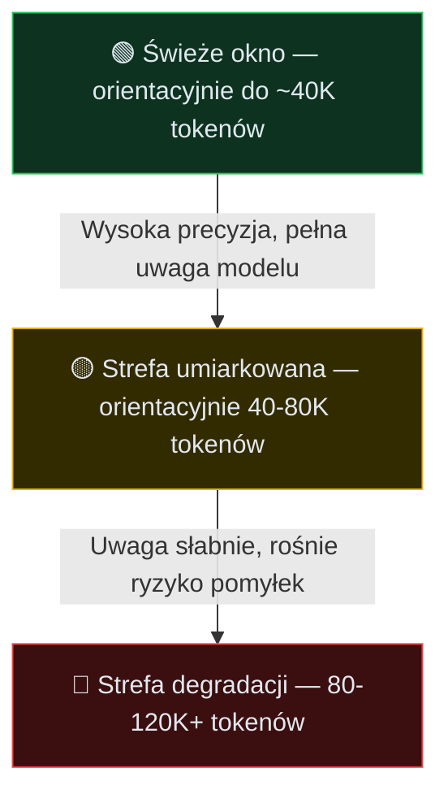

### Przewidywanie tokenów w praktyce
Najczęstszy błąd na starcie: oczekiwanie, że AI domyśli intencje, wybierze jeden właściwy sposób i opisze pracę krok po kroku — prosty prompt „zajmij się tym" na logach z produkcji często kończy się ładnym diffem, który po wdrożeniu wywala resztę aplikacji. Patrz na AI jak na system rachunku prawdopodobieństwa z twardymi ograniczeniami: generowanie błędów to rdzeń procesu, nie wypadek. Dwa grzechy integracji AI w cyklu rozwoju to ignorowanie agentów i przecenianie ich — druga skrajność jest równie niebezpieczna. Zamiast AI-voodoo — oko inżyniera: czym są modele, na jakiej architekturze bazują i gdzie twoja ingerencja jest niezbędna. Wiodące modele (np. GPT-5.4, Claude Opus 4.7) w IDE wykonują ciągłe przewidywanie kolejnego tokena; w pre-treningu nie mają obrazu twojego oprogramowania — nie wiedzą, czym jest dobra transakcyjność, nie odczuwają naruszenia SOLID; matematyczne zadanie to zminimalizowanie błędu predykcji względem danych treningowych.

### Jak to wygląda w kodzie
W treningu model widzi repozytoria, dokumentację, testy i rozmowy techniczne — nie zapamiętuje ich jak biblioteki do przeszukania, tylko aktualizuje wagi, by lepiej przewidywać następny token. Po fragmencie `item.` autocomplete może zaproponować `price` zamiast poprawnego `grossAmount`, bo statystycznie znajome — model jest skalibrowany, by wyprodukować tekst „wyglądający" najbezpieczniej, niekoniecznie działający; formatter, importy i znajome nazwy łatwo prześlizgną się przez review.
```ts
function calculateTotal(items: Item) {
  return items.reduce((sum, item) => sum + item. //jakie pole pobrać z obiektu item?
```
```ts
function calculateTotal(items: Item) {
  // Property 'price' does not exist on type 'Item'.
  return items.reduce((sum, item) => sum + item.price;
```
Trzy powtarzalne klasy błędów: kod składniowo poprawny, semantycznie błędny (happy path bez transakcji, retry lub edge case); test sprawdzający implementację zamiast zachowania; ignorowanie środka kontekstu (pamięta początek rozmowy i ostatnie polecenie, gubi decyzję sprzed kilkudziesięciu wiadomości). Podobieństwo do istniejącego kodu i poprawne importy nie eliminują wpadki. Częściowa ochrona: doświadczenie plus twarde bramki bezpieczeństwa i rygorystyczna kontrola kontekstu.

### Od zgadywania do wnioskowania
Modele rozumujące przeznaczają dodatkowy budżet na ukryte tokeny wnioskowania zamiast natychmiastowego wyniku — rozważają warianty (np. czy migracja zablokuje tabele, czy etapować, czy zmienić kolejność wdrożenia). Każdy krok kosztuje tokeny: „myśliciel" na proste formatowanie przepala budżet; tani model bazowy na głęboki refaktoring szybko zwiększa ryzyko degradacji kontekstu. W rozwiązaniach takich jak Cursor czy Claude Code effort (`low` / `high` / `xhigh`, np. Gemini 3.1 Pro (low), GPT-5.4 (high), GPT-5.3-Codex (xhigh)) oznacza dopuszczalny poziom wnioskowania — koreluje z jakością i kosztem: architektura i trudne problemy → wyżej, implementacja na gotowym planie → niżej. Rozumowanie nie zwalnia z weryfikacji — model może długo analizować i nadal zaproponować zmianę nieprzechodzącą testów lub ignorującą ograniczenie środowiska; w edytorach widzisz co najwyżej streszczenie toku myślenia, nie surowy łańcuch myśli — zachowaj kontrolę nad tym, co AI robi w projekcie.

### Twarda ściana degradacji kontekstu
Pułapka: skoro wyjście dopasowuje się do wejścia, wrzucić całe repozytorium, dokumentację i logi — „jakoś sobie poradzi". Nieistotny bagaż obniża zdolności analityczne tanich i drogich modeli; bariera **MECW** (Maximum Effective Context Window) — po przekroczeniu model gorzej wyłuskuje ważną informację; dostępne 2 miliony tokenów okna nie oznacza uwzględnienia wskazówki ze setnej strony logów. Degradacja wynika z rozkładu uwagi i sposobu doklejania kontekstu — model mocniej trzyma początek danych i ostatnie linie czatu, gubi logikę ze środka promptu. Kontroluj zajętość okna na każdym istotnym etapie (szczególnie przed rozpoczęciem nowego etapu pracy):

Duże repozytorium samo w sobie nie jest problemem — dobre narzędzia indeksują, wyszukują i selektywnie pobierają fragmenty; problem zaczyna się, gdy wrzucasz do bieżącego okna nieprzefiltrowany kontekst i liczysz, że model sam odróżni sygnał od szumu.

### Budżetowanie tokenów
Okno kontekstowe to cenna przestrzeń. Zużywają je: instrukcje systemowe; stałe instrukcje projektowe (`AGENTS.md` / `CLAUDE.md` / `Cursor Rules`); polecenia sesji (w tym tokeny myślowe przy narzędziach i komendach); definicje narzędzi / MCP. Rozdzielaj zasoby do problemu — wiedzy i kontekstu ma być dużo, ale wysokiej jakości, bez opasłej struktury i nadmiaru.
| Typ zadania                                              | Rozsądny wybór                                   |
| -------------------------------------------------------- | ------------------------------------------------ |
| Mechaniczna zmiana, formatowanie, prosta transformacja   | ekonomiczny model z niskim budżetem wnioskowania |
| Niejasna architektura, migracja, trudny błąd produkcyjny | model rozumujący z wyższym effortem              |
Wraz ze wzrostem wagi problemu inwestuj więcej tokenów w pracę modelu — lepsze efekty, wyższy koszt.

### Co warto wiedzieć
**Zasada decyzyjna:** dobieraj model do głębi problemu — rutynowe poprawki i style dla tańszych modeli, trudne problemy architektoniczne dla rozumujących z największym efforcie. **Kontrola bezpieczeństwa:** nie ufaj pewności odpowiedzi bez zewnętrznej weryfikacji — sprawdź diff, uruchom testy, zbuduj projekt, porównaj claim z dokumentacją. **Akcja na dziś:** zanim poprosisz agenta o zadanie, zastanów się, co realnie widzi — czy instrukcje projektowe, reguły lub sam prompt nie zawierają treści nadmiarowe.
