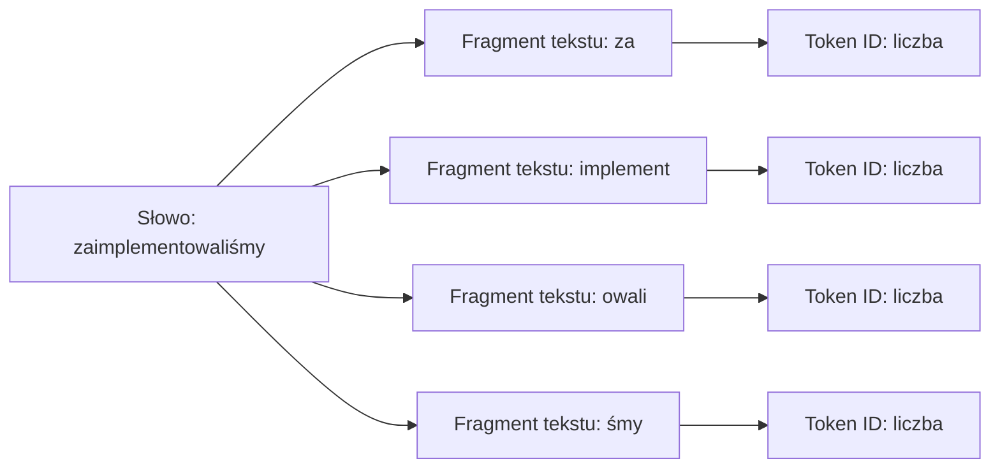

### Tokenizacja nie lubi polskiego
Wybór języka to budżet okna kontekstowego, koszt API i szum mapowania pojęć. Tekst w Claude Code lub Cursorze przechodzi przez tokenizator (BPE/unigram); angielskie słownictwo techniczne bywa pakowane oszczędniej — _fertility ratio_ mierzy tokeny na zapisane słowo.

To samo polecenie po polsku często zajmuje więcej tokenów. Przy długich sesjach (logi, pętle analityczne, testy z błędami) narzut przyspiesza _context rot_ — wymuszanie polskiego w każdym poleceniu operacyjnym zbliża do `/compact` lub `/clear` w środku refaktoringu. Test w [tokenizatorze](https://platform.openai.com/tokenizer) OpenAI (`tiktoken o200k_base`):

| Komenda operacyjna   | Tekst wejściowy (Prompt)                                     | Liczba tokenów |
| -------------------- | ------------------------------------------------------------ | -------------- |
| Angielski (domyślny) | Implement a retry mechanism with exponential backoff.        | 9 tokenów      |
| Polski (wymuszony)   | Zaimplementuj mechanizm ponowień z wykładniczym opóźnieniem. | 20 tokenów     |

Kierunek (polski droższy) często się utrzymuje. Skutki: większa historia, szybsze zużycie okna, wyższy rachunek pay-per-token.

### Rozumowanie jest ponadjęzykowe
Mit anglojęzycznego eseju do trudnej logiki nie trzyma. _OneRuler_: język wejściowy nie musi niszczyć jakości na długim kontekście; polski w części konfiguracji wypadał mocno — czytaj z metodologią, nie jako „polski zawsze wygrywa". Łamana angielszczyzna może dać więcej szumu niż sprawny opis po polsku. Przy polskim prompcie martwimy się kosztem, długością kontekstu i szumem pojęciowym — nie samą logiką modelu.

### Angielski jako domyślny tryb pracy
Stos po angielsku — nazwy domenowe, metody, wyjątki, StackOverflow. Tłumaczenie w głowie dokłada warstwę mapowania; indeks w Cursorze działa najczytelniej, gdy tokeny z promptu pasują do nazw w projekcie. Polecenia operacyjne, branchy, commity — angielski stabilizuje proces. `CLAUDE.md`, `AGENTS.md`, Cursor Rules — kontrakt po angielsku.
Polski jako „debug mode" w Plan Mode: myśl głośno po polsku zamiast wygładzać angielski (trade-off: więcej tokenów za jasność myślenia). Po akceptacji planu i przy masowych edycjach wróć do angielskiego inżynierii — oszczędzasz tokeny na potwierdzeniach, diffach i kolejnych krokach.

### Prosta polityka językowa
Język jak konfiguracja projektu — przypisujesz do typu zadania, nie „na zawsze".

| Sytuacja                                                         | Zalecany język              | Dlaczego                                                                                                     |
| ---------------------------------------------------------------- | --------------------------- | ------------------------------------------------------------------------------------------------------------ |
| Reguły projektu (AGENTS.md, CLAUDE.md, Cursor Rules)             | Angielski                   | Stabilny kontrakt dla agenta i dobre mapowanie na narzędzia, biblioteki oraz wzorce z dokumentacji.          |
| Nazwy zmiennych, funkcji, commitów, branchy                      | Angielski                   | Spójność ze stosem technologicznym i mniejszy szum w wyszukiwaniu po repozytorium.                           |
| Polecenia operacyjne do agenta                                   | Preferuj angielski          | Krótszy zapis, lepsze dopasowanie do kodu i dokumentacji.                                                    |
| UI, komunikaty, maile, treści dla użytkownika                    | Język produktu              | Jeśli aplikacja mówi do użytkownika po polsku, agent też powinien generować copy po polsku.                  |
| Reguły biznesowe, wymagania od interesariuszy, kontekst domenowy | Język najjaśniejszego opisu | Czasem polski opis księgowości, edukacji albo supportu jest bardziej precyzyjny niż wymuszony angielski.     |
| Planowanie, debugowanie, opis dziwnego błędu                     | Polski jest OK              | Jeśli po polsku szybciej dojdziesz do sedna, użyj polskiego i dopiero potem przełącz wykonanie na angielski. |

Profil do nadpisania per projekt. Zamiast „Think step-by-step" proś o artefakty: plan, założenia, ryzyka, lista plików, podsumowanie rozumowania — kontrolujesz to, co agent pokazuje przed edycją kodu.

### Co warto wiedzieć
**Reguła decyzyjna:** domyślnie steruj agentem po angielsku, generuj rezultaty w języku produktu — kod, commity, instrukcje projektowe i polecenia operacyjne po angielsku; UI copy, komunikaty i materiały użytkowe po polsku, jeśli wymaga produkt. **Kontrola bezpieczeństwa:** przy polskim sprawdzaj, czy agent nie przetłumaczył pojęć technicznych rozjeżdżających się z kodem — biblioteki, wyjątki, endpointy, flagi, terminy domenowe. **Akcja na dziś:** weź trzy najczęstsze polecenia do agenta, przygotuj angielskie wersje, porównaj tokeny w tokenizerze i zapisz najlepszą formę w regułach projektu.
